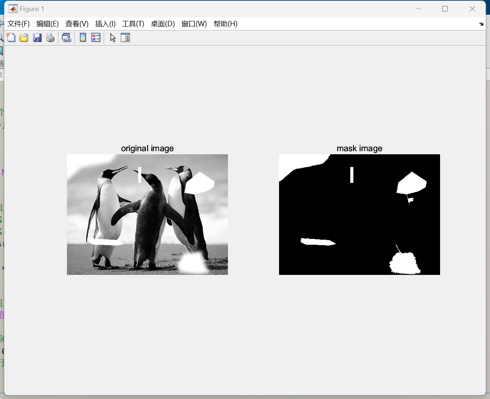

# Image Processing Project 1: README
Task Requirements:
Detect missing parts of the original image.
Restore noisy images.
Scale noisy images.
Interpolate between noisy images and the original image.
Implementation Effects and Principle Explanation:
# Task 1:
Initially, I attempted to segment the image by detecting blank pixels alone, but found that the approach lacked universality. It was effective for identifying missing parts but struggled with more complex scenarios. Therefore, I adopted a region-growing algorithm based on seed points. The region-growing algorithm is a common technique in image processing that uses certain criteria (such as grayscale similarity) to start from a seed point and gradually expand the region to identify pixel sets with similar characteristics. This method was used for image segmentation.

# Task 2:
I first explored existing denoising methods. Traditional denoising methods include spatial domain filtering: Gaussian filtering, median filtering, bilateral filtering, etc., which operate directly on pixel values in the spatial domain to achieve denoising. Transform domain filtering such as Discrete Cosine Transform (DCT), wavelet transform, etc., which convert images from the spatial domain to the transform domain and then perform filtering in the transform domain. Model-based methods like Non-Local Means (NLM) and Block-Matching 3D Filtering (BM3D) algorithms utilize the redundancy of images to remove noise.

For deep learning-based denoising methods, Convolutional Neural Networks (CNNs) leverage the powerful feature extraction capabilities of CNNs to design network structures that directly learn the mapping from noisy to clean images. Autoencoders use an encoding-decoding process to learn image representations for noise removal. Generative Adversarial Networks (GANs) improve denoising performance through adversarial training between generators and discriminators.

Comparing with mainstream methods, the current mainstream denoising algorithms are deep learning (CNN) based: DnCNN -> FFDNet -> CBDNet, while traditional denoising algorithms like Gaussian and mean filtering yield poor results.

Figures:
Figure 1. DnCNN
[1710.04026] FFDNet: Toward a Fast and Flexible Solution for CNN based Image Denoising (arxiv.org)

Figure 2. FFDNet

Figure 3. CBDNet
[1807.04686] Toward Convolutional Blind Denoising of Real Photographs (arxiv.org)

DnCNN is one of the most classic algorithms for image denoising using CNN. The algorithm is not complex but surpasses BM3D in terms of PSNR. FFDNet is an upgraded version of DnCNN, with better adaptability to noise and computational efficiency. The structure is consistent with DnCNN, but the input and output are different. This algorithm has an advantage in adapting to different noise levels due to the inclusion of a user-controlled parameter in its input. In FFDNet, a user-input noise intensity parameter σ is added, and in CBDNet, a fully convolutional network is added to learn this parameter, achieving the goal of adaptive noise reduction. This algorithm learns Gaussian-Poisson noise, which is closer to real noise, while the previous two papers learn Gaussian noise; and it combines synthetic and real noise data for model training, enhancing the model's generalization ability to better denoise real scenes.

Comparing the results of the three denoising networks, FFDNet achieved the best results; DnCNN had some denoising effect but did not completely remove the noise; the best-performing CBDNet achieved the worst results. Preliminary consideration is that this algorithm learns noise closer to real noise (Gaussian-Poisson noise), while the noise in img2.jpg is artificially added Gaussian noise, not close to real scenes, hence the poor effect.

Figure 4. TGV [1812.05023] Higher-Order Total Generalized Variation: Imaging Applications (arxiv.org)
Here, I borrowed a deep learning method, which is a higher-order anisotropic total variation regularizer, used for image denoising, wavelet transform image scaling, and reconstructing surfaces from scattered height measurements. This method extends the Total Generalized Variation (TGV) regularizer and its variants, using the primal-dual mixed gradient method to approximate numerically related gradient flows. By selecting the appropriate regularizer, this method can preserve and enhance the intrinsic anisotropic features of the image.

I have recorded the corresponding operation video and the denoising effect images.

Please note that the figures and references to arXiv papers should be properly formatted with links or included as images in your actual README file. The above text is a direct translation and may need adjustments to fit the specific structure and content of your project's README.
